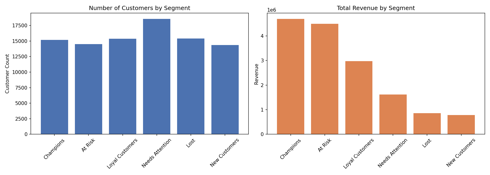

# Customer Segmentation using RFM Analysis

Segmenting e-commerce customers by Recency, Frequency, and Monetary value to identify high-value and at-risk customers, and quantify revenue concentration across segments.

## Problem Statement
Not all customers are equal — some are highly valuable, some are slipping away, and some are brand new. Which customers should the business prioritize retaining, re-engaging, or nurturing, and how much revenue is actually at stake in each group?

## Dataset
- **Source:** [Brazilian E-Commerce Public Dataset by Olist](https://www.kaggle.com/datasets/olistbr/brazilian-ecommerce) (Kaggle)
- **Scope:** 96,477 delivered orders from 93,357 unique customers, Oct 2016 – Aug 2018
- **Files used:** `olist_orders_dataset.csv`, `olist_order_payments_dataset.csv`, `olist_customers_dataset.csv`

## Method
- Merged orders, payments, and customers tables using Python (pandas) in Google Colab, joining on `customer_unique_id` to correctly identify repeat customers
- Filtered to only `delivered` orders (excluded cancelled/unavailable/in-progress orders)
- Calculated Recency, Frequency, and Monetary value per customer
- Loaded into SQLite and used SQL window functions (`NTILE`) to score each customer 1–5 on R, F, and M
- Combined scores into 6 business segments: Champions, Loyal Customers, At Risk, Needs Attention, New Customers, Lost

## Key Findings

**1. Most customers only order once**
Median order frequency per customer is 1 — repeat purchasing is rare in this dataset, which is itself a useful finding about customer retention challenges.

**2. Segment distribution is well balanced**
| Segment | Customer Count |
|---|---|
| Needs Attention | 18,565 |
| Loyal Customers | 15,354 |
| Lost | 15,414 |
| Champions | 15,164 |
| At Risk | 14,514 |
| New Customers | 14,346 |

**3. Revenue is heavily concentrated — and "At Risk" customers matter almost as much as "Champions"**

| Segment | Customers | Total Revenue | Avg Revenue/Customer |
|---|---|---|---|
| Champions | 15,164 | 4,696,728.55 | 309.73 |
| At Risk | 14,514 | 4,490,311.66 | 309.38 |
| Loyal Customers | 15,354 | 2,974,687.60 | 193.74 |
| Needs Attention | 18,565 | 1,614,995.69 | 86.99 |
| Lost | 15,414 | 859,081.28 | 55.73 |
| New Customers | 14,346 | 786,656.99 | 54.83 |

Champions and At Risk customers combined represent **~60% of total revenue** despite being only ~32% of the customer base. At Risk customers have nearly identical average spend to Champions (309.38 vs 309.73) — meaning these are proven high-value customers who simply haven't purchased recently, not low-value customers to write off.

## Recommendation
- Prioritize win-back campaigns for the "At Risk" segment before the "Lost" segment — they represent nearly as much historical revenue as Champions, making reactivation high-value and urgent.
- For "Champions," focus on retention (loyalty perks, early access) rather than acquisition spend, since losing them is the highest-revenue risk.
- "Needs Attention" is the largest segment by count but contributes relatively little revenue per customer — worth testing low-cost nurture campaigns (email, discounts) rather than high-touch outreach.

## Repo Structure
- `/data` — RFM-scored customer table and segment revenue summary
- `/sql` — SQL queries for RFM scoring (NTILE) and segment revenue aggregation
- `/notebooks` — full Colab notebook with cleaning, merging, and analysis
- `/dashboard` — segment visualization charts
